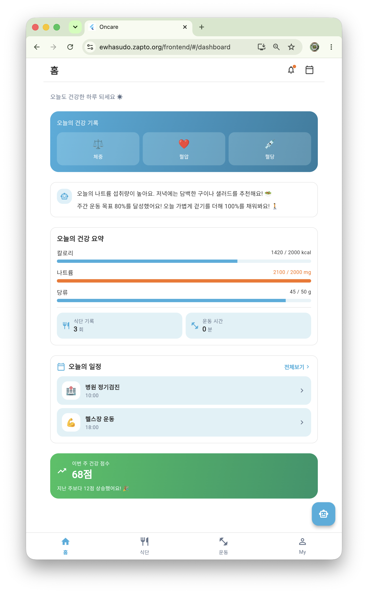
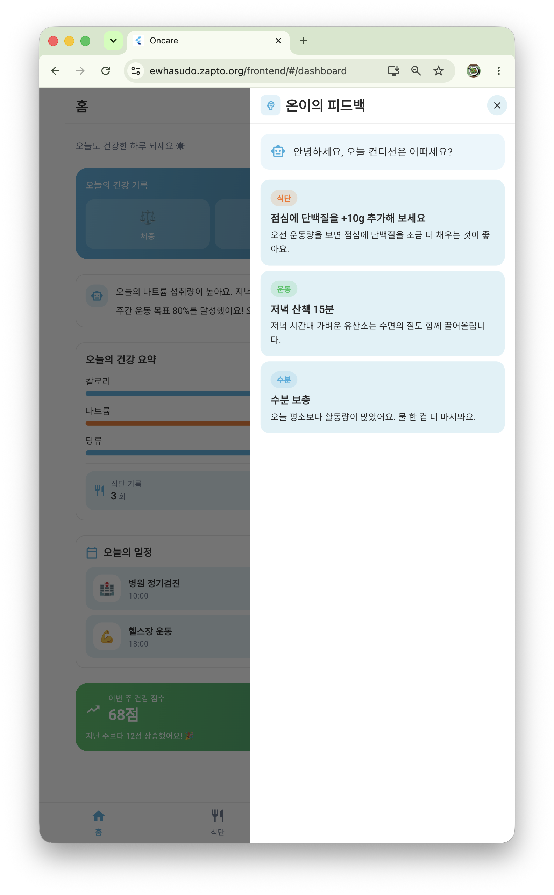
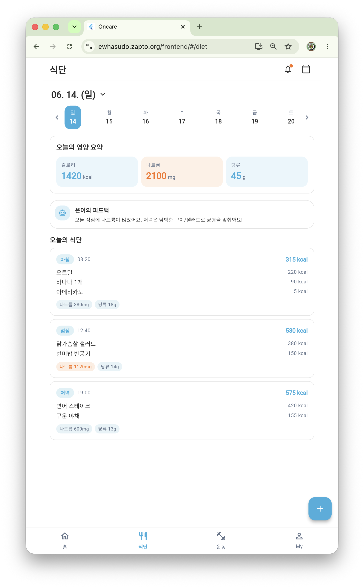
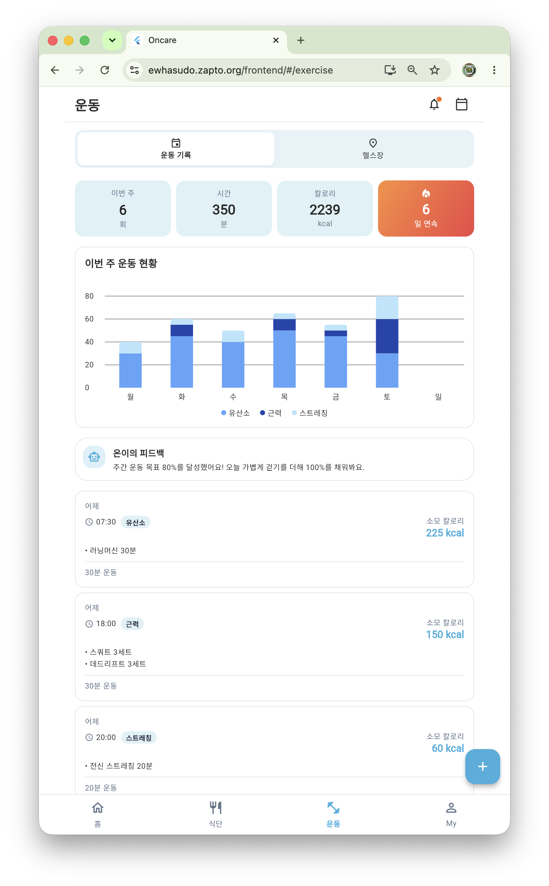
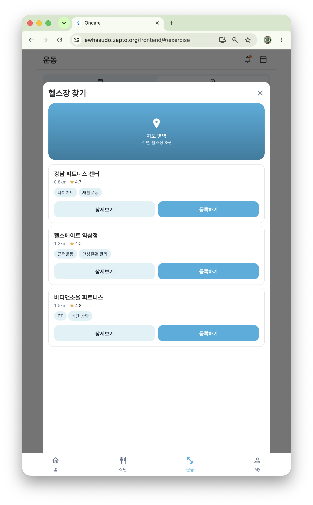
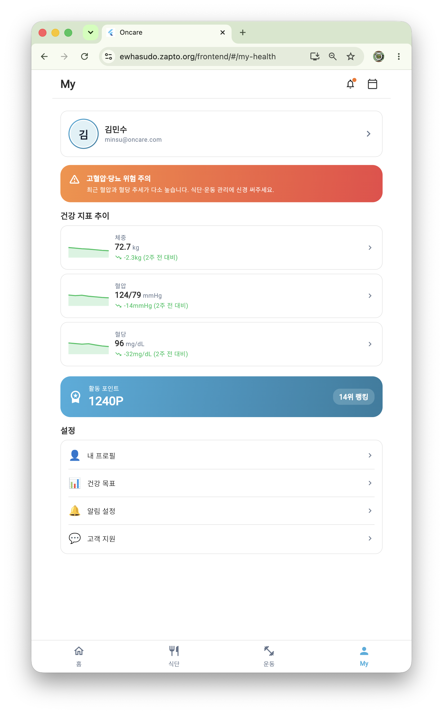
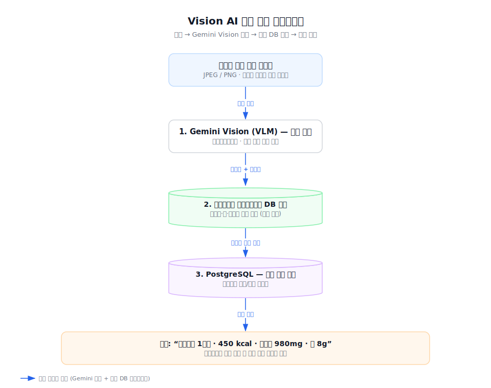
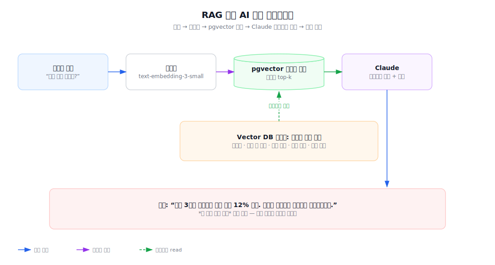
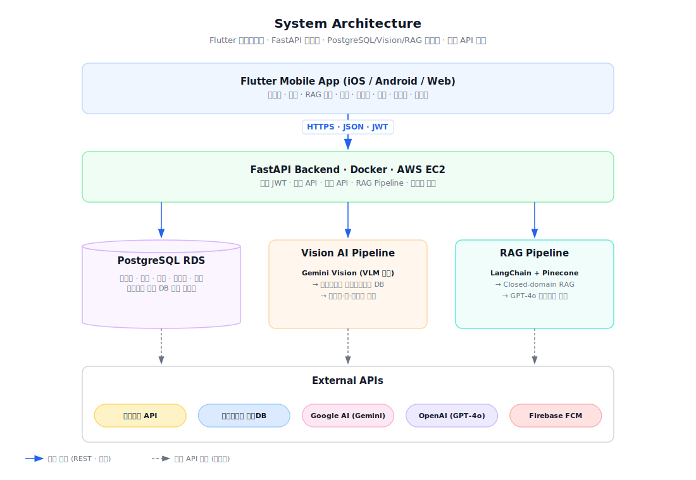

<div align="center">


<br/><br/>


# On-care 

***HealthMate AI: 불규칙한 생활 속 2030을 위한<br> 고혈압·당뇨 위험군 대상 식단 인식·코칭 통합 헬스케어 플랫폼***

<br/>

[](https://ewhasudo.zapto.org/)
[](https://ewhasudo.zapto.org/frontend/#/dashboard)
[](https://youtu.be/C4ivM_dlAww?si=8iOWmOpSxcpQmlU3)

<br/><br/>

</div>

**On-Care** is an AI healthcare platform for 20–30s at risk of hypertension & diabetes — one photo auto-logs a meal's sodium & sugar, RAG coaching learns from your history, and O2O links offline gyms & trainers. *A polished Flutter MVP (live web demo) backed by a FastAPI + PostgreSQL server — Vision-AI food recognition and a pgvector RAG coach are implemented; the app runs on local mock by default and connects to the live backend via one build flag.*

## Index

[Quick Facts](#quick-facts) · [Current Implementation Status](#current-implementation-status) · [Why On-Care](#why-on-care) · [Problem](#problem) · [Solution](#solution) · [Key Features](#key-features) · [Screenshots](#screenshots) · [Vision AI Pipeline](#vision-ai-pipeline) · [RAG Pipeline](#rag-pipeline) · [System Architecture](#system-architecture) · [Tech Stack](#tech-stack) · [Competitive Analysis](#competitive-analysis) · [Development Roadmap](#development-roadmap) · [User Interview & Feedback](#user-interview--feedback) · [Repository Structure](#repository-structure) · [Getting Started](#getting-started) · [Collaboration](#collaboration--workflow) · [AI Transparency](#ai-transparency) · [What's Next](#whats-next) · [Team](#team) · [License](#license)

---

## Quick Facts

| Item | Description |
|------|------|
| Project | On-Care — AI Healthcare Platform |
| Target User | 20–30s at risk of hypertension / diabetes |
| Frontend | Flutter (iOS · Android · Web) · local mock (default) |
| Backend | FastAPI · PostgreSQL(pgvector) · JWT |
| AI | Gemini · Claude Vision 식단 인식 · RAG 코치 (pgvector · GPT-4o/Gemini) |
| Status | Flutter MVP live · FastAPI 백엔드 + AI 엔진 구현 · 앱↔백엔드 플래그 전환 |

<br/>

## Current Implementation Status

범례 — ✅ 구현·동작  ·  🟡 부분 구현 (데이터·실연동 보완 필요)  ·  🔵 설계 단계

| 영역 / 구성요소 | 상태 | 근거 |
|---|:---:|---|
| 크로스플랫폼 UI — 홈·식단·운동·My + AI 코치 패널 · 반응형 웹 | ✅ | 라이브 데모 · `frontend/flutter/lib/features/` |
| 건강 지표 기록·7일 추세 · 통합 일정 캘린더 · 헬스장 찾기 UI | ✅ | `frontend/flutter/lib/features/` |
| 디자인 시스템 · 로컬 백엔드(drift + LocalApiInterceptor) · 테스트·자동 배포 | ✅ | `frontend/flutter/` · `.github/workflows/deploy.yml` |
| FastAPI 백엔드 — 9개 라우터 · PostgreSQL(pgvector) · JWT 인증 · 16개 테스트 | ✅ | `backend/app/` · `backend/tests/` |
| Gemini · Claude Vision 식단 인식 (엔진 교체형) | ✅ | `backend/app/services/recognizer/` |
| RAG 코치 — pgvector 검색 + GPT-4o/Gemini 생성 (임베더 폴백) | ✅ | `backend/app/services/coach/` |
| 공공데이터 영양성분 DB 매핑 | 🟡 | `backend/app/services/nutrition/` (구조 ✅ · 데이터 규모 제한) |
| 카카오맵 실연동 · Firebase FCM 푸시 | 🟡 | `backend/app/api/v1/places.py` (엔드포인트 ✅ · 실연동 pending) |

*Flutter 코드 경로는 `frontend/flutter/` 기준입니다. 앱↔백엔드 실연동은 `--dart-define=USE_MOCK_API=false`.*

<br/>

## Why On-Care

> 2030 세대의 만성질환 유병률이 구조적으로 급증하고 있다. 그러나 시장의 헬스케어 앱들은 여전히 *기록의 번거로움*, *맥락 없는 획일적 조언*, *온·오프라인의 단절* 이라는 세 가지 한계를 벗어나지 못한다.

On-Care 는 이 세 가지 마찰을 정면으로 해결하기 위해, 사진 한 장으로 식단을 자동 분석하고 누적 이력을 RAG 로 참조해 *내 데이터를 아는* 맞춤 조언을 제공합니다. 식단·운동·헬스장·일정·상담의 단일 앱 통합(Flutter MVP)과, 이를 뒷받침하는 **FastAPI 백엔드(Vision 인식·RAG 코치)** 를 구현했습니다.

<br/>

## Problem

20~30대를 대상으로 한 국민건강보험공단·자체 사용자 인터뷰 결과, 다음의 다섯 가지 페인 포인트가 일관되게 관찰되었습니다.

| # | 페인 포인트 | 본질 |
|---|-------------|------|
| 1 | **수치적 위험은 급증, 도구는 정체** | 최근 5년 2030 당뇨 +38%, 고혈압 +28%. 그러나 기존 앱은 여전히 수동 검색 / 바코드 입력 방식. |
| 2 | **기록 → 행동 변화 단절** | 매끼 입력은 요구하지만, 누적 데이터 기반의 *맥락 있는* 피드백이 없어 사용자는 3일 안에 이탈. |
| 3 | **개인화 부재** | 칼로리 알림 수준. 만성질환자에게 진짜 필요한 건 *얼마나 먹었나* 가 아니라 *무엇을 피해야 하나*. |
| 4 | **다이어트 패러다임의 한계** | 시장 대부분이 체중 감량·소셜 챌린지 중심. 질환 관리에 부적합. |
| 5 | **온·오프라인 분리** | 트레이너·헬스장 연결이 없어 사용자가 앱 밖으로 이탈. 정보 흐름의 연속성 부재. |

> 💬 실제 사용자 인터뷰에서도 *"매번 식단을 일일이 검색하고 수동으로 입력하는 게 너무 번거로워 결국 중단하게 된다"* 는 의견이 지배적이다.

**한 줄 요약** — 기존 헬스케어 앱은 *기록 중심 · 비개인화 · 파편화* 된 구조로 인해, 만성질환 위험군의 지속적 건강 관리와 실제 행동 변화를 만들어내지 못한다.

<br/>

## Solution

On-Care 는 위 다섯 가지 마찰을 다음의 네 가지 기술적 의사결정으로 제거합니다.

| 마찰 | On-Care 의 해법 |
|------|----------------|
| 기록의 번거로움 | **Gemini Vision 파이프라인** — Gemini(VLM)가 음식 인식·추정, 나트륨·당·칼로리는 공공데이터 영양성분 DB 로 교정 |
| 맥락 없는 조언 | **RAG 기반 AI 코치** — 사용자 인바디·식단·운동·질환 이력을 pgvector 에 임베딩, GPT-4o/Gemini 에 실시간 컨텍스트로 주입 |
| 질환 무관 설계 | **2030 고혈압·당뇨 위험군 도메인 특화** — 나트륨 추적·GI 분류·불규칙 식사 패턴 감지 |
| 온·오프라인 분리 | **O2O 통합** — 카카오맵 기반 헬스장 검색·예약, 트레이너 인앱 채팅, 건강 요약 자동 전달 |

**핵심 가치** — *기록 도구가 아닌, 행동 변화를 만드는 앱.*

<br/>

## Key Features

| 기능 | 상태 | 설명 | 핵심 기술 |
|------|------|------|-----------|
| **Vision AI 식단 자동 인식** | ✅ 구현 | 음식 사진 1장으로 식품 종류·영양소를 분석·기록 | Flutter UI + 백엔드 <br> *(Gemini·Claude 인식 + 영양 DB)* |
| **RAG 기반 AI 헬스 챗봇** | ✅ 구현 | 사용자 건강 이력을 실시간 컨텍스트로 주입해 개인 맞춤 코칭 제공 | Flutter UI + 백엔드 <br> *(pgvector · GPT-4o/Gemini)* |
| **AI 맞춤 운동 코칭** | ✅ 구현 | 체력·목적·건강 상태 기반 운동 루틴·피드백 | Flutter UI + 백엔드 <br> *(운동 도메인 RAG 코치)* |
| **헬스장 검색 & 트레이너 연동** | 🟡 부분 | 위치 기반 검색·예약·트레이너 인앱 채팅 UX | Flutter UI + 백엔드 <br> *(카카오맵 실연동 pending)* |
| **통합 건강 일정 관리** | ✅ 구현 | 식단·운동·병원 예약 캘린더 통합 및 대시보드 연동 | Flutter + FastAPI |
| **Streak 보상 시스템** | 🟡 부분 | 활동 포인트 · 주간 운동 연속 달성(streak) 집계 | Flutter + FastAPI |

> 범례 — ✅ 구현 · 🟡 부분 구현 · 🔵 설계 단계. 앱은 기본 mock 으로 동작하며 플래그로 백엔드 연동 — 상세는 [Current Implementation Status](#current-implementation-status).

<br/>

## Screenshots

빠른 미리보기를 위한 주요 화면입니다. **전체 구동 흐름은 [▶ 데모 영상](https://youtu.be/C4ivM_dlAww?si=8iOWmOpSxcpQmlU3)** 에서 확인하실 수 있습니다.<br/>
(배포 웹 데모: [`ewhasudo.zapto.org/frontend`](https://ewhasudo.zapto.org/frontend/#/dashboard) · Flutter · iOS / Android / Web 단일 코드베이스)

<table>
  <tr>
    <td width="33%" align="center"><b>홈 대시보드</b></td>
    <td width="33%" align="center"><b>온이의 AI 피드백</b></td>
    <td width="33%" align="center"><b>식단 기록</b></td>
  </tr>
  <tr>
    <td align="center"></td>
    <td align="center"></td>
    <td align="center"></td>
  </tr>
  <tr>
    <td align="center">체중·혈압·혈당 빠른 기록 + 나트륨·당류 예산</td>
    <td align="center">오늘 기록 기반 식단·운동·수분 맞춤 코칭</td>
    <td align="center">끼니별 영양 분석 · 나트륨/당류 추적</td>
  </tr>
  <tr>
    <td width="33%" align="center"><b>운동 관리</b></td>
    <td width="33%" align="center"><b>헬스장 찾기 (O2O)</b></td>
    <td width="33%" align="center"><b>My — 건강 지표 추이</b></td>
  </tr>
  <tr>
    <td align="center"></td>
    <td align="center"></td>
    <td align="center"></td>
  </tr>
  <tr>
    <td align="center">주간 운동 누적 차트 + Streak 연속 기록</td>
    <td align="center">위치 기반 헬스장 검색·등록 · 트레이너 연계</td>
    <td align="center">체중·혈압·혈당 추세 + 위험 알림 + 활동 포인트</td>
  </tr>
</table>

<br/>

## Vision AI Pipeline
> Gemini · Claude Vision 인식 엔진이 [`backend/app/services/recognizer/`](backend/app/services/recognizer/) 에 **엔진 교체형**으로 구현되어 있습니다. **Gemini Vision(VLM) 단독 인식 + 공공데이터 영양성분 DB 매핑** 구조입니다.

사진 한 장이 어떻게 영양 정보로 변환되는지:

<p align="center">
  
</p>

> **핵심 설계** — **Gemini·Claude Vision(VLM)** 이 한 번의 호출로 음식 종류·추정 섭취량을 인식합니다 (다중 음식·변형 한식·신메뉴까지 커버). 단, **나트륨·당·칼로리는 사진만으로 판별 불가**하므로 인식된 음식명을 **공공데이터 식품영양성분 DB** 와 매핑해 수치를 교정합니다 — VLM 의 환각을 검증된 DB 값으로 차단하는 하이브리드 구조입니다.
>
> *식단 인식 아키텍처 3종(VLM 단독 · YOLO+VLM 2단계 · YOLO 단독)과 최신 비전 모델을 비용·정확도·지연·운영 부담 기준으로 정량 비교한 결과, **단일 VLM 인식 + 영양 DB 매핑**이 이 도메인에서 가장 우수한 구성이었습니다 — 최신 VLM이 다중 음식을 단일 호출로 인식하고, 나트륨·당은 어떤 방식이든 DB 조회가 필수이기 때문입니다.*

<br/>

## RAG Pipeline
> RAG 코치가 [`backend/app/services/coach/`](backend/app/services/coach/) 에 구현되어 있습니다: **PostgreSQL pgvector 벡터 검색 + GPT-4o/Gemini 생성** (임베더는 OpenAI/Gemini, 키 없으면 해시 폴백으로 오프라인 동작). 사용자 건강 기록을 실시간 컨텍스트로 주입해 개인화 코칭을 만듭니다.

사용자의 질문이 어떻게 개인화된 답변으로 변환되는지:

<p align="center">
  
</p>

> 단순 일반 정보가 아닌 ***내 이번 주 기록 기준*** 맞춤 조언이 핵심 차별점입니다. 한국영양학회 등 공인 데이터만 인덱싱하는 Closed-domain RAG + 프롬프트 가드레일로 의료 행위 위험을 차단합니다.

<br/>

## System Architecture
> FastAPI 백엔드 · PostgreSQL(pgvector) · JWT 인증 · AI 인식/RAG 코치가 [`backend/app/`](backend/app/) 에 구현되어 있습니다 (9개 라우터 · 16개 테스트). Flutter 앱은 기본 로컬 mock 으로 동작하며, 빌드 플래그 한 줄로 실 백엔드에 연동됩니다. AWS 배포 인프라는 다음 단계입니다.

<p align="center">
  
</p>

<br/>

## Tech Stack

**Mobile**


**Backend**


**AI / ML**


**Platform & APIs**


<br/>

## Competitive Analysis

기존 헬스케어 플랫폼의 공백을 정확히 공략합니다.

| 비교 항목 | 삼성헬스 | 필라이즈 | 밀리그램 / 인아웃 | **On-Care** |
| :--- | :--- | :--- | :--- | :--- |
| **식단 기록 방식** | 직접 검색 · 수동 입력 | 사진 기반 AI 인식 | 사진 저장 · 빠른 입력 위주 | **사진 1장 → Gemini/Claude Vision 인식 + 공공데이터 영양성분 DB 자동 매핑** |
| **한국 음식 정확도** | 보통 | 보통 | 낮음 (사용자 등록 의존) | **높음 (공공데이터 식품영양성분 DB 검증)** |
| **AI 코칭 방식** | 활동 데이터 단편 해석 | AI 코치 + 전문가 Q&A | 소셜·챌린지 동기부여 | **RAG 기반 누적 이력 실시간 참조 맥락 코칭** |
| **만성질환 특화** | 없음 (범용) | 일부 (혈당 연동 등) | 없음 (다이어트 중심) | **2030 고혈압·당뇨 위험군 도메인 특화** |
| **오프라인 연결** | 없음 | 없음 | 없음 | **헬스장 검색·예약·트레이너 채팅 + 건강 요약 자동 전달 (O2O)** |
| **플랫폼 독립성** | 갤럭시 생태계 종속 | iOS / Android | iOS / Android | **Flutter 단일 코드베이스 iOS / Android 동일 경험** |

세부 분석은 [`docs/competitive_analysis.md`](docs/competitive_analysis.md) 참조.

<br/>

## Development Roadmap

On-Care는 Ideation을 넘어 **Flutter MVP · FastAPI 백엔드 · AI 파이프라인(Vision·RAG)** 까지 구현했으며, O2O 실연동·앱↔백엔드 연동·배포를 진행 중입니다.

| Stage | 개발 범위 | 상태 |
| :--- | :--- | :--- |
| **S0 · Ideation** | 사용자 인터뷰 · 시장 분석 · 도메인 Pain Point 검증 | ✅ 완료 |
| **S1 · Prototype** | Flutter 웹 프로토타입 설계 및 핵심 UX 흐름 검증 | ✅ 완료 |
| **S2 · Flutter MVP** | 디자인 시스템 구축 · Riverpod 상태 관리 · MVP 핵심 화면 구현 | ✅ 완료 |
| **S3 · FastAPI Backend** | FastAPI 서버 · PostgreSQL(pgvector) · JWT 인증 · REST API · 테스트 | ✅ 완료 |
| **S4 · Vision AI** | Gemini · Claude Vision 인식 + 공공데이터 영양성분 DB 매핑 (엔진 교체형) | ✅ 완료 |
| **S5 · RAG Coach** | pgvector 기반 GPT-4o/Gemini 개인화 맥락 코칭 엔진 | ✅ 완료 |
| **S6 · O2O & Reward** | 카카오맵 실연동 · 트레이너 채팅 · Streak 보상 · 앱↔백엔드 연동 · 배포 | 🚧 진행 중 |

<br/>

## User Interview & Feedback

On-Care 서비스의 실질적인 유효성을 검증하기 위해, 핵심 타깃층인 2030 고혈압·당뇨 위험군 실제 사용자 3인을 대상으로 진행한 인터뷰 및 MVP 사용성 테스트(UT) 요약입니다. *(Vision AI·RAG 코치 등 AI 화면은 프로토타입 데모 인터랙션으로 시연했습니다.)* <br>

세부 내용은 [`docs/user_interview.md`](docs/user_interview.md) 참조.

* **인터뷰 참여자 정보 (Target Users)**
  * **참여자 A (25세, 대학원생)**: 불규칙한 식습관으로 최근 검진에서 '당뇨 전단계(공복혈당 주의)' 판정을 받음
  * **참여자 B (28세, 회사원)**: 부모님 모두 고혈압 약을 복용 중이신 '가족력 유의군'이며, 혈압 관리가 필요한 상태
  * **참여자 C (31세, 프리랜서)**: 만성적인 운동 부족으로 검진에서 '혈압 주의 및 고지혈증 위험군'으로 분류됨
* **MVP 핵심 피드백 (What Welcomed)**
  * **Vision AI 식단 자동 인식**: *"사진 한 장으로 나트륨과 당류 같은 성분이 자동 계산되어 수동 입력의 번거로움과 기록 마찰이 획기적으로 줄었습니다." (참여자 A)*
  * **RAG 기반 AI 코칭 챗봇**: *"AI 코치가 내 주간 기록을 기반으로 맥락 있는 피드백을 제공하는 흐름이 기존 앱보다 더 개인화되어 있다고 느껴졌습니다." (참여자 B)*
  * **통합 건강 일정 관리**: *"병원 정기검진일과 헬스장 스케줄을 단일 캘린더로 합쳐주고 메인 대시보드와 실시간 동기화해 주니 일상 속 실천을 지속하는 데 큰 도움이 됩니다." (참여자 C)*
* **사용자 피드백 기반 한계점 (Limitations)**
  * 조리 방식이나 양념에 숨겨진 영양성분의 정확한 추정 오차 가능성이 지적됨
  * 혈당·혈압 수치를 수동 입력해야 하는 번거로움과 실시간 생체 지표 변화 감지의 한계가 존재함
  * 현재의 O2O 솔루션이 건강 요약본을 트레이너에게 일방향으로 '전송'하는 수준에 머물러 있음

> 💡 위 세 가지 핵심 기술적 한계점을 극복하기 위한 On-Care의 구체적인 향후 발전 방향은 아래 **What's Next** 아키텍처 확장 계획안에서 다룹니다.

<br/>

## Repository Structure

```
sudo-capstone-project/
├── frontend/                   # 프론트엔드 (Flutter 단일 코드베이스)
│   ├── README.md               # frontend 안내 → flutter/
│   └── flutter/                # Flutter 앱 (iOS / Android / Web)
│       ├── lib/
│       │   ├── app/            # 라우팅 · 부트스트랩
│       │   ├── core/           # 네트워크 · 스토리지 · 에러 처리
│       │   ├── design_system/  # 토큰 · 위젯 · 차트
│       │   ├── features/       # 도메인 모듈 (dashboard / diet / exercise / my_health / ...)
│       │   └── shared/         # 공통 위젯 · 모달
│       ├── test/               # 단위 · 위젯 · golden · 통합 테스트
│       ├── docs/               # Flutter 설계 문서 (PLAN · STRUCTURE · DESIGN_TOKENS · API_CATALOG …)
│       └── README.md           # Flutter 모듈 개발·빌드 가이드
├── backend/                    # FastAPI 백엔드 (구현) — AI 인식 · RAG 코치 · PostgreSQL
│   ├── app/                    # api/v1 라우터 · core · db · models · schemas
│   │   └── services/           # recognizer(Gemini·Claude·YOLO) · nutrition · coach(RAG) · embedder
│   ├── tests/                  # 16개 테스트 (diet · auth · rag · exercise …)
│   ├── migrations/             # Alembic 스키마 마이그레이션
│   └── API_CONTRACT.md · Dockerfile · docker-compose.yml · requirements.txt · README.md
├── docs/                       # 프로젝트 문서 · 발표 자료 · 다이어그램 · 스크린샷
├── .github/                    # PR 템플릿 · GitHub Pages 배포 워크플로우
├── index.html                  # 배포 랜딩(소개) 페이지
├── self_demo.md                # 셀프 데모 시연 가이드
├── LICENSE · CONTRIBUTING.md · SECURITY.md · CODE_OF_CONDUCT.md · CITATION.cff   # 커뮤니티 헬스 파일
└── README.md
```

**개발·설계 문서** — [PLAN](frontend/flutter/docs/PLAN.md) (재구성 계획·상태관리 등 기술 선택 근거) · [STRUCTURE](frontend/flutter/docs/STRUCTURE.md) (디렉토리·계층 아키텍처) · [API_CATALOG](frontend/flutter/docs/API_CATALOG.md) (도메인 모델 ⇆ API 카탈로그) · [DUMMY_BACKEND](frontend/flutter/docs/DUMMY_BACKEND.md) (백엔드 없이 풀기능 동작하는 로컬 목 전략)

<br/>

## Getting Started

> 로컬 실행은 **별도 백엔드 없이** 동작합니다 — 기본값 `USE_MOCK_API=true` 로 drift 로컬 DB의 seed 데이터를 사용합니다.

### Prerequisites
- **Flutter** — stable 채널 (Dart SDK `>= 3.10.0`)
- **Chrome** — 웹 데모 실행용
- *(선택)* Android Studio / Xcode — 모바일 빌드 시
- 설치 상태 점검: `flutter doctor`

### Run on Web
```bash
# 1) 저장소 클론 후 Flutter 프로젝트로 이동
git clone https://github.com/CSE-Sudo-26/sudo-capstone-project.git
cd sudo-capstone-project/frontend/flutter

# 2) 의존성 설치
flutter pub get

# 3) drift 웹 런타임 다운로드 (sqlite3.wasm + drift_worker.js)
#    web/ 의 두 파일은 .gitignore 되어 있어, 클론 후 1회 받아야 웹에서 정상 동작합니다.
bash tool/fetch_drift_wasm.sh

# 4) 실행 (Chrome)
flutter run -d chrome
```

### Run on Android / iOS *(선택)*
```bash
flutter devices                 # 연결된 디바이스 / 에뮬레이터 ID 확인
flutter run -d <device-id>      # 디버그 실행
# 릴리스 빌드: flutter build apk  |  flutter build ios
```

### Verify (quality gates)
```bash
flutter analyze     # 정적 분석 (lint)
flutter test        # 단위 · 위젯 · golden 테스트
```

### Backend — FastAPI 서버 실행 *(선택 · 앱은 mock 으로도 동작)*
AI 인식 · RAG 코치 · PostgreSQL 을 포함한 FastAPI 백엔드입니다. 상세는 [`backend/README.md`](backend/README.md) 참조.
```bash
cd backend
cp .env.example .env          # JWT_SECRET · (선택) AI 키 설정 — 키 없으면 stub/해시 폴백
docker compose up --build     # http://localhost:8000/docs  (경로: /v1/...)
```
> Flutter 앱을 실 백엔드에 연결: `flutter run --dart-define=USE_MOCK_API=false --dart-define=API_BASE_URL=http://localhost:8000/v1`

<br/>

## Collaboration & Workflow

팀 협업은 **GitHub Flow + 이슈 기반 개발**로 운영합니다.

- **Pull Request 리뷰 필수** — 모든 변경은 PR로, 리뷰 승인 후 머지
- **AI 코드 리뷰** — [CodeRabbit](.coderabbit.yaml) 자동 리뷰 연동
- **Conventional Commits** — `feat:` · `fix:` · `docs:` 등 커밋 컨벤션 준수
- **표준 템플릿** — [PR 템플릿](.github/pull_request_template.md) · 이슈 단위 작업 추적
- 기여·행동강령·보안: [CONTRIBUTING](CONTRIBUTING.md) · [CODE_OF_CONDUCT](CODE_OF_CONDUCT.md) · [SECURITY](SECURITY.md)

<br/>

## AI Transparency

본 프로젝트는 기획·문서화·UI 초안·코드 구현 과정에서 생성형 AI 도구(ChatGPT · Claude · Gemini 등)를 **보조 도구로** 활용했습니다. AI의 제안을 그대로 적용하지 않고 *만성질환 위험관리*라는 목적과 실제 구현 범위에 맞게 검증·수정했으며, 서비스 방향 설정·타깃 사용자 정의·UX 설계·GitHub 협업 관리는 팀이 직접 수행했습니다.

> 도구별 활용 범위와 검증 방식은 [`docs/ai_transparency_report.md`](docs/ai_transparency_report.md) 에 상세히 기록되어 있습니다.

<br/>

## What's Next

| 방향 | 설명 | 기대효과 |
|------|------|----------|
| **연속혈당측정기 및 웨어러블 연동** | CGM(연속혈당측정기) API 및 스마트워치(Galaxy Watch / Apple Watch)의 SDK 를 연동 | 수동 입력 마찰 완전 제거, **식후 혈당 스파이크·급격한 혈압 상승을 실시간 감지** 하여 즉각적인 AI 위험 경고 트리거 구축 |
| **3D Depth 기술 기반 식단 인식 고도화** | 스마트폰의 LiDAR 센서나 Depth 정보를 활용하여 음식의 3차원 부피(Volume) 를 정밀 추정하는 모델 도입 | 공공데이터 식품영양성분 DB 매핑 정확도 극대화, **칼로리·성분 오차 범위 5% 이내로 축소** |
| **쌍방향 O2O 피드백 루프 및 가상 트레이닝** | 트레이너 전용 웹 대시보드를 구축하여 트레이너가 처방한 운동 루틴이 유저의 'AI 맞춤 운동 코칭 엔진' 에 즉시 동적 반영되도록 아키텍처 확장 | **진정한 온·오프라인 하이브리드 헬스케어 생태계 완성** |

> 웨어러블 연동, 3D 식단 인식, 트레이너 연계를 통해 실시간 건강 예측과 개인 맞춤 코칭이 가능한 통합 헬스케어 생태계를 구축하는 것을 목표로 합니다.

<br/>

## Team


|                                                         최지수                                                          |                                                            박서연                                                            |                                                           신수빈                                                           |
|:--------------------------------------------------------------------------------------------------------------------:|:-------------------------------------------------------------------------------------------------------------------------:|:-----------------------------------------------------------------------------------------------------------------------:|
| <br/> | <br/> | <br/> |
|                                         [@aJISUa](https://github.com/aJISUa)                                         |                                      [@seoyeon0516](https://github.com/seoyeon0516)                                       |                                       [@subin21cc](https://github.com/subin21cc)                                        |
|                                               Data Analyst & Back-end                                                |                                                     DevOps & Back-end                                                     |                                                     AI & Front-end                                                      |


<br/>

## License

본 프로젝트는 [MIT License](LICENSE) 하에 배포됩니다. 자세한 내용은 [`LICENSE`](LICENSE) 파일을 참고하세요.

> Copyright © 2026 On-Care Team (CSE-Sudo-26: 최지수 · 박서연 · 신수빈)

<br/>

---

<div align="center">

**2026 이화여자대학교 캡스톤디자인**

*Team 02 Sudo — Jisu Choi · Seoyeon Park · Subin Shin*

</div>
