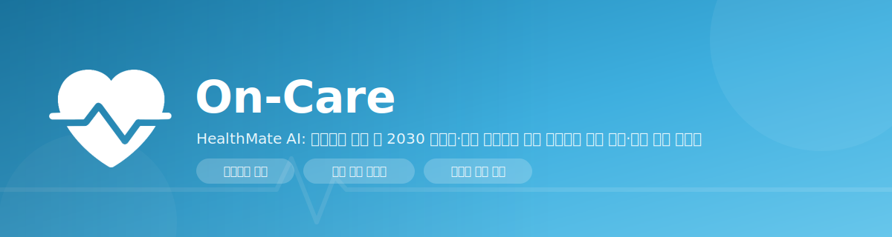
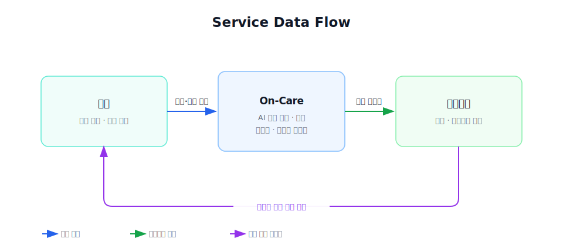
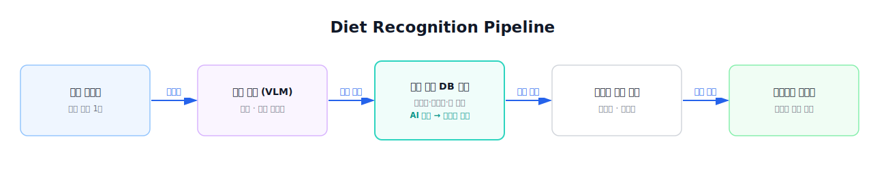
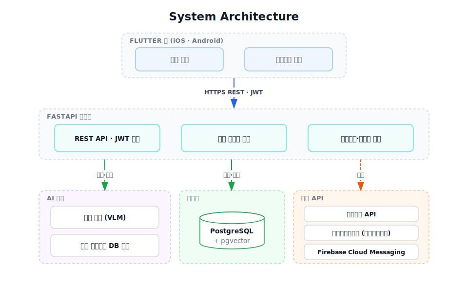

<h1>On-Care</h1>

**Trainer-Linked Diet &amp; Exercise Coaching Platform**

*HealthMate AI: 불규칙한 생활 속 2030 고혈압·당뇨 위험군을 위한 트레이너 연계 식단·운동 코칭 플랫폼*

 

 

 

<em><b>On-Care</b> turns scattered trainer–member messaging into data-driven coaching — a member's meals and workouts are auto-organized into daily reports for their trainer. Built for young adults in their 20s–30s at risk of hypertension &amp; diabetes.</em>

---

## Overview

**On-Care**는 헬스 트레이너와 회원 사이의 식단·운동 관리 소통을 자동화하는 플랫폼입니다. 회원이 음식 사진 한 장·간단한 입력만 하면 앱이 식단과 운동을 회원별·날짜별로 정리해 트레이너에게 전달하고, 트레이너는 흩어진 메시지를 뒤지는 대신 정리된 리포트 위에서 코칭합니다.

**타깃 유저**는 불규칙한 생활로 만성질환 위험이 커진 **2030 고혈압·당뇨 위험군**입니다. 이 세대는 야근·배달·불규칙한 식사로 위험이 빠르게 느는데도 질환 인지·관리율은 전 연령에서 가장 낮아 **관리의 공백이 가장 큰 층**이기 때문입니다. 이들에게는 단순 칼로리 계산이 아니라 *"무엇을 피하고 어떻게 움직여야 하는지"* 를 이어주는 관리가 필요합니다.

---

## Problem

트레이너와 회원 모두 **"기록은 하는데, 그 기록이 관리로 이어지지 않는"** 같은 벽에 부딪힙니다.

| 대상 | 현재 겪는 어려움 |
| --- | --- |
| 🏋️ **트레이너** | 회원 30~40명의 식사·운동을 개별 메신저로 일일이 확인하느라 하루 한 시간 넘게 쓰지만, 대화가 흩어져 회원별 흐름이 한눈에 보이지 않습니다. 회원이 늘수록 관리 품질이 떨어져 **확장이 어렵습니다.** |
| 🧍 **회원** | 매 끼 검색·입력하는 번거로움에 기록을 며칠 만에 포기하고, 어렵게 남긴 기록도 **"그래서 무엇을 바꿔야 하는지"** 로 이어지지 않습니다. |

이 문제를 겨냥한 서비스는 이미 많았지만 정착하지 못했습니다. 회원용 기록 앱과 트레이너용 도구가 **서로 분리되어**, 회원의 데이터가 트레이너에게 정리된 형태로 닿지 않기 때문입니다. 결국 관리는 다시 메신저로 돌아옵니다. On-Care는 바로 이 **끊어진 연결**을 잇습니다.

---

## Background Evidence &amp; Data

2030 세대의 만성질환은 빠르게 느는데, 정작 이 연령대의 인지·관리율은 가장 낮습니다. 이 **관리 공백**이 On-Care가 겨냥하는 지점입니다.

| 지표 (연령대 · 조사연도) | 수치 |
| --- | --- |
| **당뇨병** 유병률 (19–39세 · ~2020) | 10년 새 **2배** (1.02% → 2.02%, 약 37만 명) |
| **당뇨병 전단계** (19–39세 · ~2020) | **26.5%** (약 303만 명) |
| **고혈압** 인지율 / 치료율 (20–39세 · 2022) | **36% / 35%** (전체 성인 77% / 74%) |
| 고혈압 치료 **미순응** (20–39세 · 2022) | **84.9%** (20대는 24%만 꾸준히 치료) |
| **유산소 신체활동** 실천율 (성인 전체 · 2014→2020) | 58.3% → **45.6%**, 좌식 7.5 → 8.6시간 |

※ 지표마다 연령대·조사연도가 다릅니다(신체활동은 성인 전체 추세). 동일 표본의 직접 비교가 아니라, 2030 중심의 만성질환 증가와 관리 공백을 함께 보여주는 근거로 제시합니다.

Sources — [Diabetes Fact Sheets in Korea 2024](https://www.e-dmj.org/journal/view.php?number=2909) · [Korea Hypertension Fact Sheet 2024](https://pmc.ncbi.nlm.nih.gov/articles/PMC11903208/) · [Physical Activity Trends, KNHANES](https://pmc.ncbi.nlm.nih.gov/articles/PMC9100085/) · [The Korea Herald](https://www.koreaherald.com/article/10478765)

---

## Solution

회원의 기록은 앱 안에서 자동으로 정리되어 트레이너에게 넘어가고, 트레이너의 코칭은 다시 회원에게 돌아옵니다. 회원은 최소한의 노력으로 관리받고, 트레이너는 더 많은 회원을 더 높은 품질로 관리하며, 그 사이의 모든 판단은 감이 아닌 **데이터**를 근거로 이루어집니다.

---

## Key Features

| 기능 | 설명 |
| --- | --- |
| 📷 **간편 식단 기록** | 음식 사진을 찍으면 AI(VLM)가 음식과 양을 추정하고, 식약처 공공 DB의 영양성분 참고값을 조회해 나트륨·칼로리·당 추정치를 제공합니다. 완벽한 자동 계산이 아니라 기록 부담을 없애는 것이 목적이며, **최종 값은 회원·트레이너가 확인·보정**해 신뢰도를 높입니다. |
| 🏋️ **운동 기록 자동 연동** | 트레이너가 세션에서 입력한 프로그램·수행이 회원 기록에 자동 반영되어, 회원이 일일이 적지 않아도 데이터가 쌓입니다. |
| 📊 **자동 요약 리포트** | 식단·운동·활동을 회원별·날짜별로 묶어 트레이너에게 전달합니다. *"이 회원, 이번 주 나트륨 과다 · 유산소 부족"* 을 한눈에 파악합니다. |
| 🔗 **데이터 기반 매칭** | 회원의 목표와 조건(위치·시간·성향)에 맞춰 트레이너·헬스장을 추천하고 앱 안에서 연결합니다. |
| 🎯 **목표·미션 관리** | 만성질환 위험군에 맞춘 나트륨·활동량 목표와 일일 미션. 많이 먹은 날은 활동량을, 적게 먹은 날은 식단을 조정하는 **식단↔운동 연동 코칭**을 제공합니다. |

---

## Diet Recognition Pipeline

사진에서 시작해 VLM이 음식과 양을 추정하고, **공공 영양성분 DB 참고값**으로 추정치를 보정한 뒤, 구조화된 기록과 트레이너 리포트로 이어집니다. 최종 값은 회원·트레이너가 확인·수정할 수 있습니다.

---

## System Architecture

---

## Tech Stack

| 영역 | 사용 기술 |
| --- | --- |
| **Frontend** | Flutter · Dart · Riverpod · GoRouter (회원/트레이너 이중 모드) |
| **Backend** | FastAPI · SQLAlchemy · Alembic · JWT · Docker |
| **Database** | PostgreSQL · pgvector |
| **AI** | Vision(VLM) 식단 인식 · 식약처 공공 영양성분 DB 매칭 · RAG 코치 |
| **Infra** | AWS · GitHub Actions (CI/CD) |
| **External API** | 카카오맵 · 공공데이터포털 · Firebase Cloud Messaging |

---

## Competitive Analysis

| 항목 | 필라이즈 | 밀리그램·인아웃 | **On-Care** |
| --- | :---: | :---: | :---: |
| **식단 기록** | 사진 AI 인식 | 사진·빠른 입력 | **사진 → 공공 영양 DB 매칭** |
| **트레이너 연계** | 앱 내 AI 코치만 | 없음 | **회원 데이터 자동 정리 → 트레이너 전달** |
| **회원 관리 확장성** | 없음 | 없음 | **1인이 다수 회원을 데이터로 관리** |
| **만성질환 특화** | 일부 (혈당) | 체중 감량 중심 | **고혈압·당뇨 위험군 (나트륨·GI)** |
| **데이터 흐름** | 개인 앱 내 완결 | 개인 앱 내 완결 | **회원 ↔ 트레이너 양방향** |

> 기존 서비스는 회원 개인의 기록에서 끝납니다. On-Care는 그 기록을 **트레이너의 코칭 자원으로 연결**하는 흐름 자체가 차별점입니다.

---

## Target &amp; Business Model

On-Care의 **핵심 타깃**은 **2030 고혈압·당뇨 위험군과 이들을 관리하는 트레이너**입니다. 이 세대는 가성비·선택권에 민감해, 무료 진입 후 선택적 유료화 구조와 잘 맞습니다.

| 구분 | 모델 |
| --- | --- |
| **메인** | 트레이너·헬스장 **중개 수수료 / 구매 전환 커미션** · 트레이너용 **고도화 기능 구독** |
| **프리미엄** | 기본 기능은 무료로 진입장벽을 낮추고, 가치를 체감한 사용자가 고도화 기능을 결제 |
| **부수** | 광고(상위 노출 등)는 보조 수입으로만 |

> **확장 방향** — 서비스가 자리 잡은 뒤에는 구매력이 크고 편의성을 중시하는 40대+ 로 타깃을 넓혀, 같은 제품을 프리미엄 제안으로 확장할 수 있습니다.

---

## Team

|                                                         최지수                                                          |                                                            박서연                                                            |                                                           신수빈                                                           |
|:--------------------------------------------------------------------------------------------------------------------:|:-------------------------------------------------------------------------------------------------------------------------:|:-----------------------------------------------------------------------------------------------------------------------:|
|   |   |   |
|                                         [@aJISUa](https://github.com/aJISUa)                                         |                                      [@seoyeon0516](https://github.com/seoyeon0516)                                       |                                       [@subin21cc](https://github.com/subin21cc)                                        |
|                                               Data Analyst & Back-end                                                |                                                     DevOps & Back-end                                                     |                                                     AI & Front-end                                                      |

> *지도교수: 황의원 교수님 (이화여자대학교 · 컴퓨터공학전공)*

---

## License

본 프로젝트는 [MIT License](LICENSE) 하에 배포됩니다. 자세한 내용은 [`LICENSE`](LICENSE) 파일을 참고하세요.

> Copyright © 2026 On-Care Team (CSE-Sudo-26: 최지수 · 박서연 · 신수빈)

 

---

**2026 이화여자대학교 캡스톤디자인**

*Team 02 Sudo — Jisu Choi · Seoyeon Park · Subin Shin*

